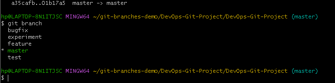
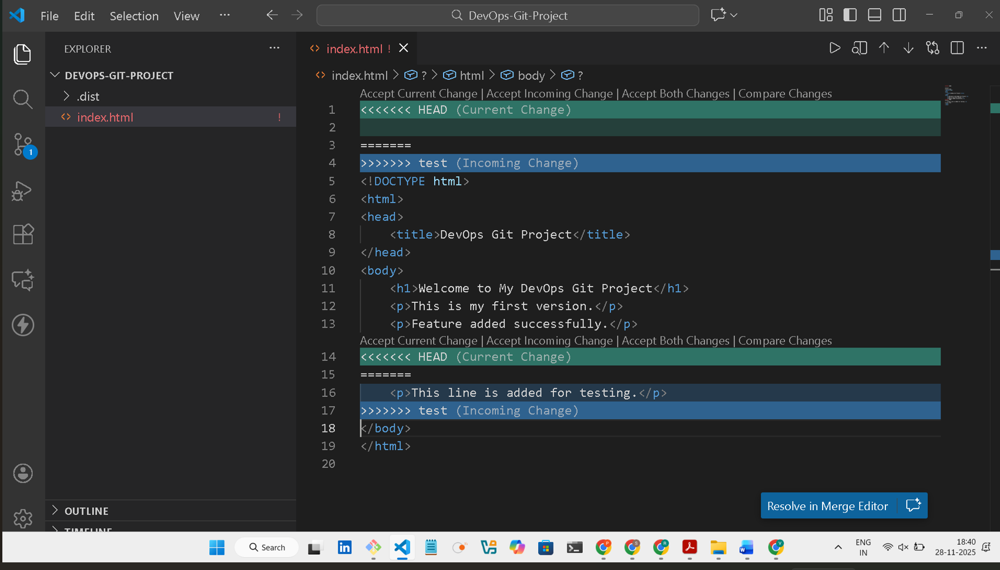
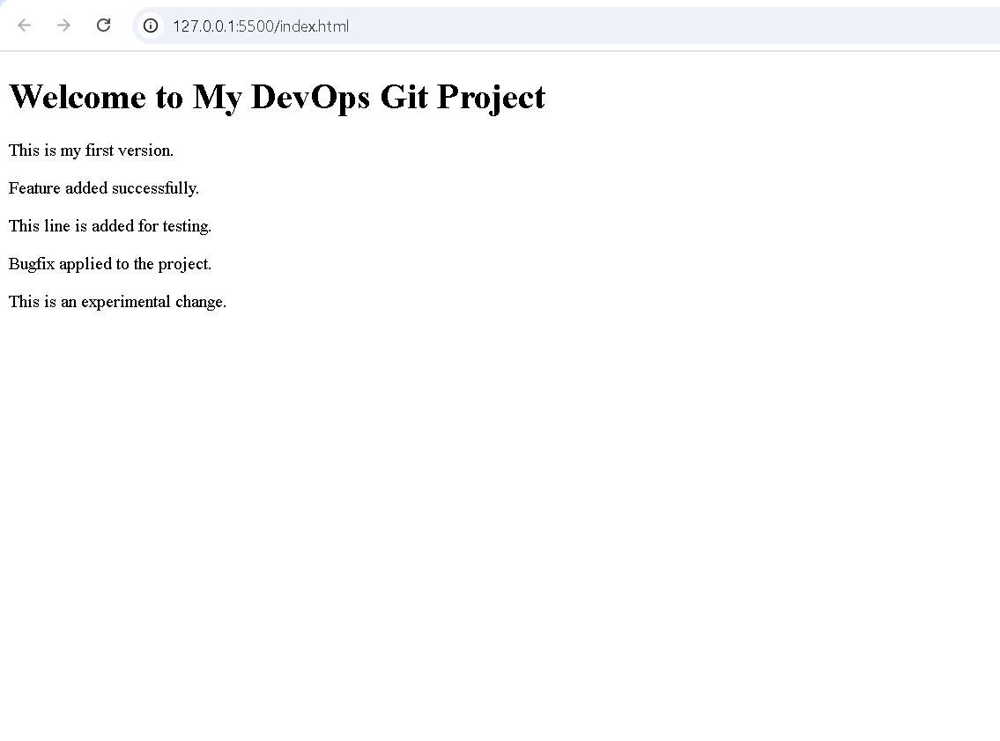
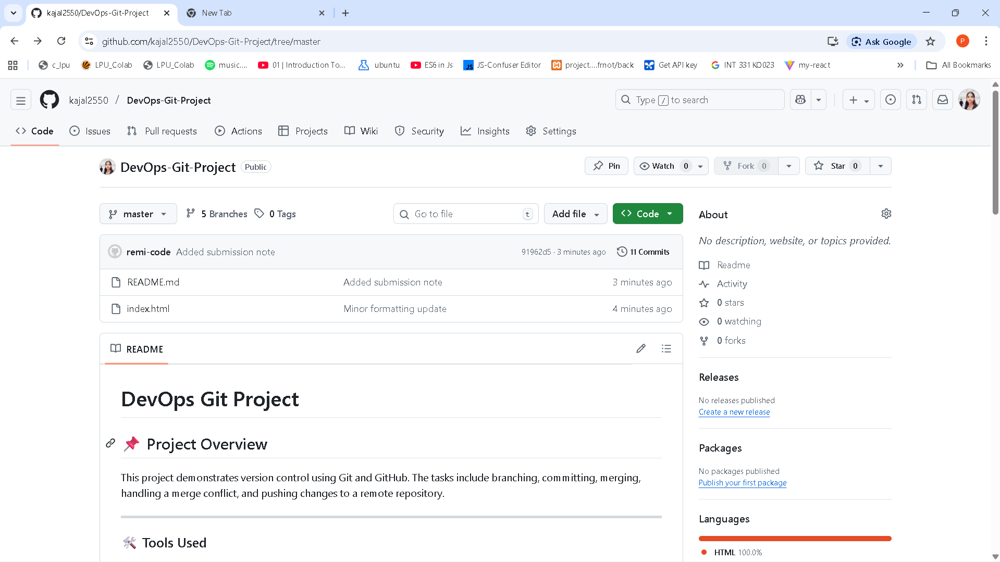

 # DevOps Git Project

## 📌 Project Overview
This project demonstrates version control using Git and GitHub. The tasks include branching, committing, merging, handling a merge conflict, and pushing changes to a remote repository.

---

### 🛠 Tools Used
- Git Bash
- VS Code
- GitHub

---

### 🔀 Git Workflow Steps

| Step | Command Used |
|------|-------------|
| Initialize repository | `git init` |
| Check repo status | `git status` |
| Add files | `git add .` |
| Commit changes | `git commit -m "message"` |
| Create branches | `git branch feature`, `git branch test`, `git branch bugfix`, `git branch experiment` |
| Switch branch | `git checkout branchname` |
| Merge branches | `git merge branchname` |
| Resolve conflict | Manual edit + `git add` + `git commit` |
| Add remote origin | `git remote add origin <URL>` |
| Push code | `git push -u origin master` |

---

### 🧪 Merge Conflict
A merge conflict occurred while merging the `test` branch. The issue was resolved manually by editing `index.html` and then committing the resolution.

---

### 📈 Commit History Command

git log --oneline --graph --all

---

### 🖼 Project Screenshots
(*Screenshots will be added here later*)
 
 ## 📸 Project Screenshots

### 🔹 Branches Screenshot  

---

### 🔹 Merge Conflict Screenshot  

---

### 🔹 Final Output Screenshot  

---

### 🔹 GitHub Repository Screenshot  

---

### 🎯 Learning Outcomes

- Understanding of branching and merging in Git
- Handling merge conflicts
- Working with remote repositories
- Practical exposure to version control workflows

---

### ✔ Conclusion

This project helped me gain hands-on experience in Git branching, merging, and managing repositories using GitHub. It improved my understanding of version control concepts and real-world collaboration workflows.

---
(Updated for submission)

### 👩‍💻 Submitted By
**Name:** Kajal  
**Course:** DevOps
